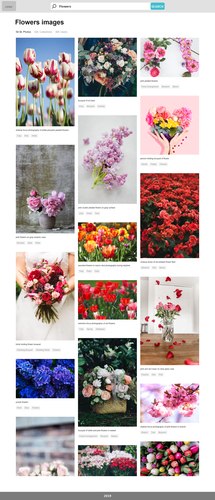

# Front-End Test Case

This is a simple front-end code challenge created to serve two purposes:

1. Show off your skills,
1. Give us a better understanding of your skills.

## Additional Instructions

> * **Fork this repository**
> * After you're done, provide us the link to your repository.
> * Leave comments where you were not sure how to properly proceed.
> * Implementations **without** a README will be automatically rejected.
> * No pull requests
> * ES6 and above

## The Task

The programming challenge exists in 2 parts:
* **Part A**: HTML + CSS
* **Part B**: JavaScript

### PART A: HTML + CSS

* Create a layout based on the given screen (fe_test_example_screen.jpg).
* Style the layout consistently and beautifully, adhering as closely to the design as possible.
* **NOTE:** You are free to use any preprocessor you wish, or write raw SCSS/CSS. *Bonus points for an explanation of your choice.*

### PART B: JavaScript

* Consume https://unsplash.com/ public API @ https://unsplash.com/developers to retrieve a list of images.
* Display the first 10 images in the HTML + SCSS/CSS layout created in step A with infinite scroll, sticking to the layout, placing data where it fits.
* **NOTE:** You are free to use any framework you wish, or do it VanillaJS style. *Brief explanation of your choice.*

## Bonus Points

* Tests
* Clean code!
* Knowledge of application flow.
* Knowledge of modern best practices/coding patterns.
* Demonstration of good state management.
* Usage of frameworks/supersets.
* Pixel perfection.
* Componential thinking.
* Usage of linters.
* Git hooks.
* Usage of Material Design concepts
